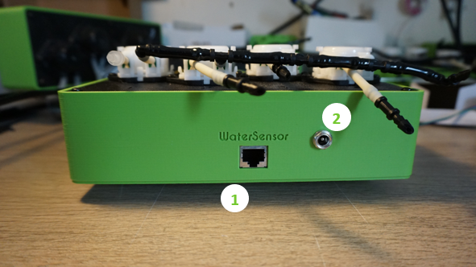

<!--#module-io-->
## Module IO
<!--#module-io-->
Here are details of the I/O. Connector types/number and placement will be optimized for the final version.

 
1. EC/temp sensor (jack 3.5mm)
2. Water sensor USB power supply
3. Module link cable
4. Manual button
5. EC/temp. sensor (BNC)
6. PH sensor
 

 
1. Module link cable
2. WaterPump power supply
