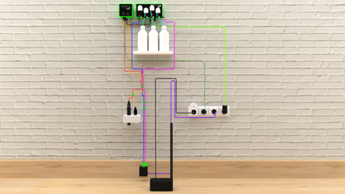

<!--#wiring-->
## Wiring
<!--#wiring-->
Here is a detail of each cable: 1 cable = 1 color. 
You can’t make a mistake as each cable has one type of connector it can go in. 

* pH sensor
* EC/Temp. sensor
* WaterPump Input
* WaterPump Output
* Containers Tubes
* WaterSensor power supply
* WaterPump power supply
* Module Link cable
* Your irrigation pump
* Mix pump
