<!--#parts-list-->
## Parts List
<!--#parts-list-->

* 1x Water Sensor  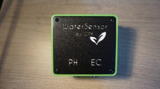
* 1x Water Pump 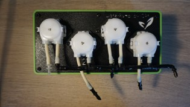
* 1x EC Sensor + 1x pH Sensor + 2x Cable Holder 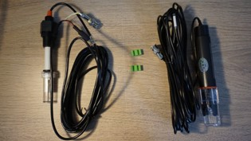
* 1x Water Sensor PowerSupply + 1x USB Cable + 1x Module link cable 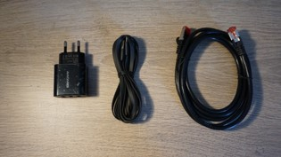
* 1x Water Pump Power Supply 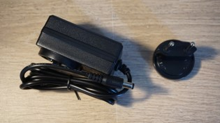
* 1x EC/pH sensor floater 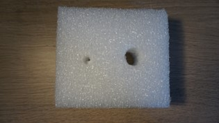
* 1x Water Pump I/O tubes 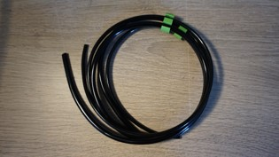
* 1x pH solution tube (smaller one) + 2x EC solution tube with check valve 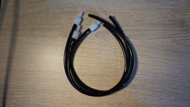
* 1x mix pump and solution injector 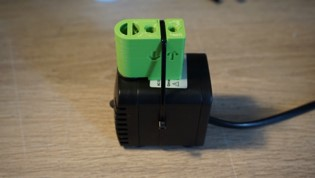
* 1x Tube/Cable Hook 
* 2x Wall Mount 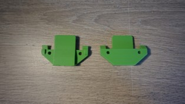
* 5x Screw for wall mont 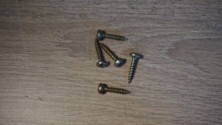
* 1x Wifi socket for irrigation control 
* 1x Spare parts bag 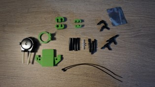
* 1x Plug Adapters (outside EU standard countries) 
  