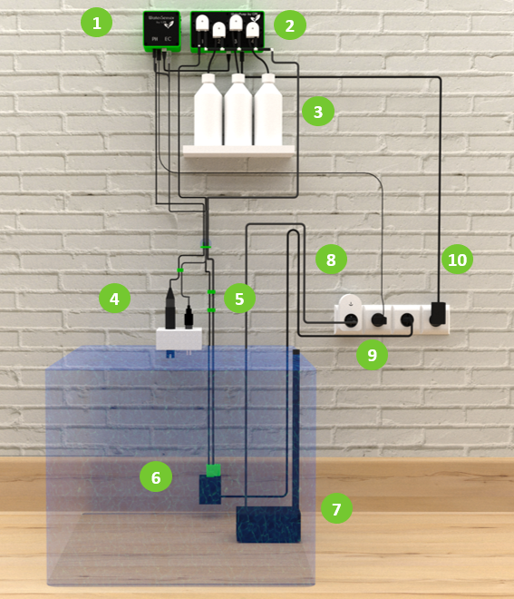

<!--#typical-setup-->
## Typical Setup
<!--#typical-setup-->
This setup is designed for the Beta version and will be optimized before release. 

1. WaterSensor
2. WaterPump
3. Nutritive solution containers
4. PH sensor
5. EC/temp. sensor
6. Mix pump
7. User’s irrigation pump
8. Wifi socket
9. WaterSensor power supply
10. WaterPump power supply
