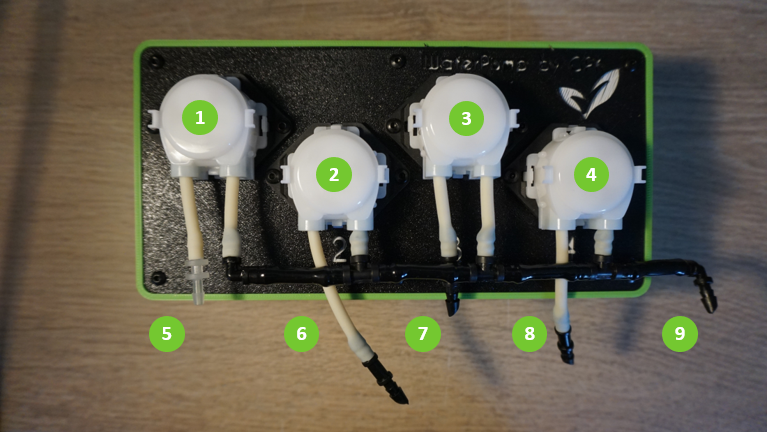

<!--#waterpump-io-->
## Water Pump IO
<!--#waterpump-io-->
The Beta WaterPump is equipped with 4 peristaltic pumps. Those pumps are interesting because they can pump water, air, a wide range of viscosity, are accurate, can be easily maintained and are reliable!
Final version will allow multiple WaterPump modules up to 20 pumps!

1. Water pump
2. PH pump
3. EC 1/A pump
4. EC 2/B pump
5. Solution injection circuit input
6. PH solution input
7. EC 1/A solution input
8. EC 2/B solution input
9. Solution injection circuit input
