<!--#module-installation-->
### Module Installation
<!--#module-installation-->

* Screw the 2 wall mounts (1 & 2) on your support without too much force so the part doesn’t break. 
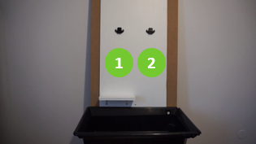 

* Insert both modules (1 & 2). You can use both wall mounts as those are the same for both devices.
Prepare your container support (3), leave 30-35cm between the WaterPump and your container support. 
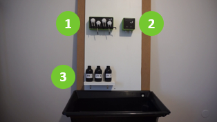 

* Plug the PH probe (1 - BNC). 
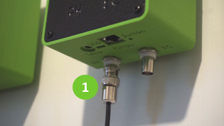 

* Plug the first EC connector (1 - BNC). 
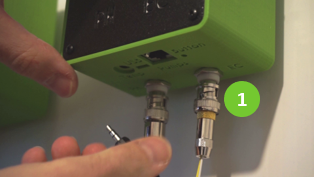 

* Plug the second ECconnector (1 - jack 3.5mm). 
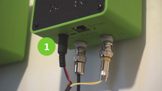 

* Plug the module link cable on both modules (1). 
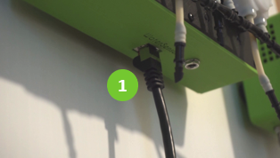 

* Plug the WaterPump power supply (1 - jack 5.1mm). 
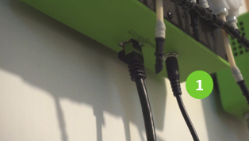 

* Plug the WaterSensor power supply (1). 
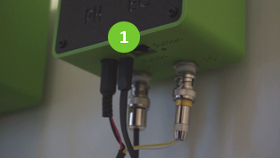 

* Plug the WaterSensor power supply(1 -USB). 
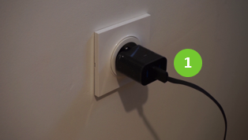 

* Insert the EC sensor in the Sensor Floater (1). Leave approximately 1cm between the plastic cap and the floater and remove the cap. 
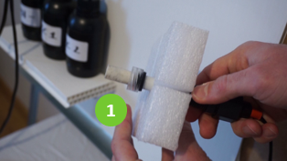 

* Insert the PH sensor in the sensor floater.The protection cap (1) should be near the floater and the sensing part must be the same side as the EC sensor’s. 
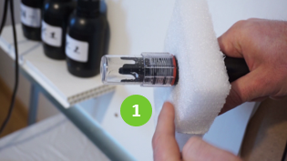 

* Remove your container caps (1). 
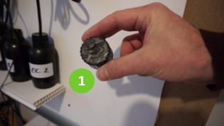 

* Drill a 6mm hole in your container caps (1).!!! Be very careful not to arm yourself with the tool you’ll use !!! 
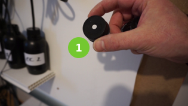 

* Insert each container solution tube in your drilled container caps. The check valve of the EC tubes must be pointing inside the container (1). 
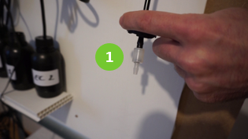 

* Screw the container caps (1). 
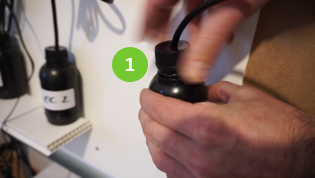 

* Plug each solution tube (1) this way:
  - PH to pump number 2 (small white connector)
  - EC 1/A to pump number 3 (bigger black connector)
  - EC 2/B to pump number 4 (bigger black connector)

    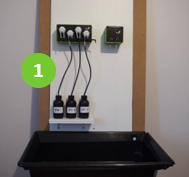 

* Insert the small WaterPump IO tube in the Mixer Pump’s smaller hole. Insert it until you feel the stop (1). Be careful not to go too far as it would block the WaterPump inlet, thus blocking regulation... 
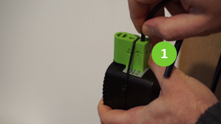 

* Insert the large WaterPump IO tube in the Mixer Pump’s larger hole. Insert it until you feel the stop (1). Again, be careful not to go too far as it would block the WaterPump inlet, thus blocking regulation... 
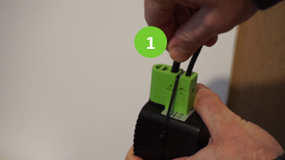 

* Install the Mix Pump in your water tank. You can let it float freely as long as it’s able to spread the solutions uniformly from the pump output. Adjust the flow knob if it’s too strong for your water volume so that it doesn’t spread water out of the water tank (1). 
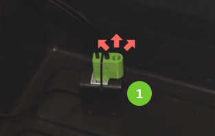 

* Place the Sensor Floater in your water tank with the sensor parts facing down (1). 
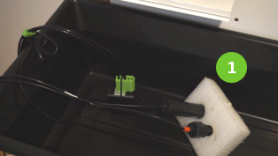 

* If you need to, you can Install the tube/cable hook (1) on the side of your water tank as high as you can. It’s not mandatory as certain water tank won’t allow its use. 
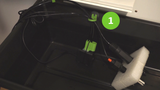 

* Connect the WaterPump input and output on the WaterPump side. The small tube goes on the left (1) and the large one on the right (2). 
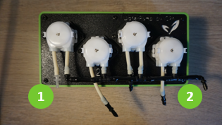 

* Plug the Wifi power socket (1) and plug your irrigation pump in it (2).(beta-tester outside of EU standard must use the provided socket adapters). 
 

* Fill up your water tank (1) and be sure that the Sensor Floater is in a flat position, sensor parts facing down. 
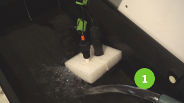 

* Plug the WaterPump (1) and Mix Pump (not shown).
(beta-tester outside of EU standard must use the provided power socket adapters). 
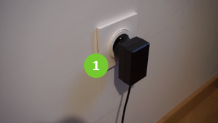 

 
And this is all for the hardware installation, Now it’s time to connect your Smartphone or computer to your device. For this you have 2 solutions. 

 
 
Scan the QR code below to watch our Youtube tutorial. 

 
Or continue in the next section
